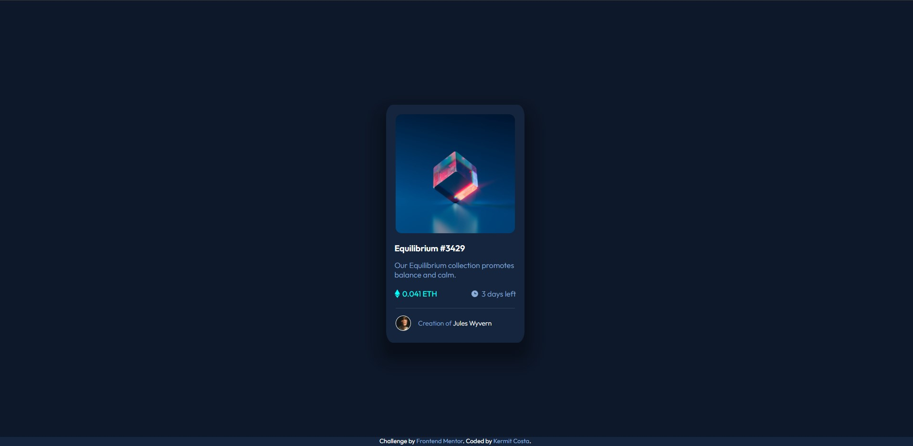

# Desafio Frontend Mentor - NFT preview card component

## 💬 Sobre

Esta é uma solução para o [NFT preview card component](https://www.frontendmentor.io/challenges/nft-preview-card-component-SbdUL_w0U).

 

## 🎯 Objetivo

✅ Desenvolver uma aplicação web que apresenta um componente "Card NFT" ficando o mais próximo possível do modelo proposto no desafio. Os usuários devem ser capazes de:

  <ul><li>Ver o layout ideal dependendo do tamanho da tela do dispositivo;</li>
  <li>Ver as alterações de "hover" para os elementos interativos.</li></ul>

 

## 🛠 Tecnologias Utilizadas

 HTML5

 CSS3

 

## ▶ Demonstração

Abaixo, uma Screenshot com a demonstração do aplicativo e logo após um link para poder testá-lo no GitHub pages.

 

## <a href="https://kermitcosta.github.io/nft-preview-card-component-main/">Link para teste</a>
